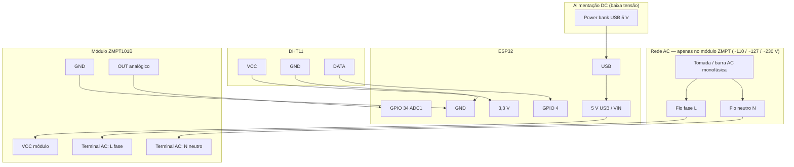
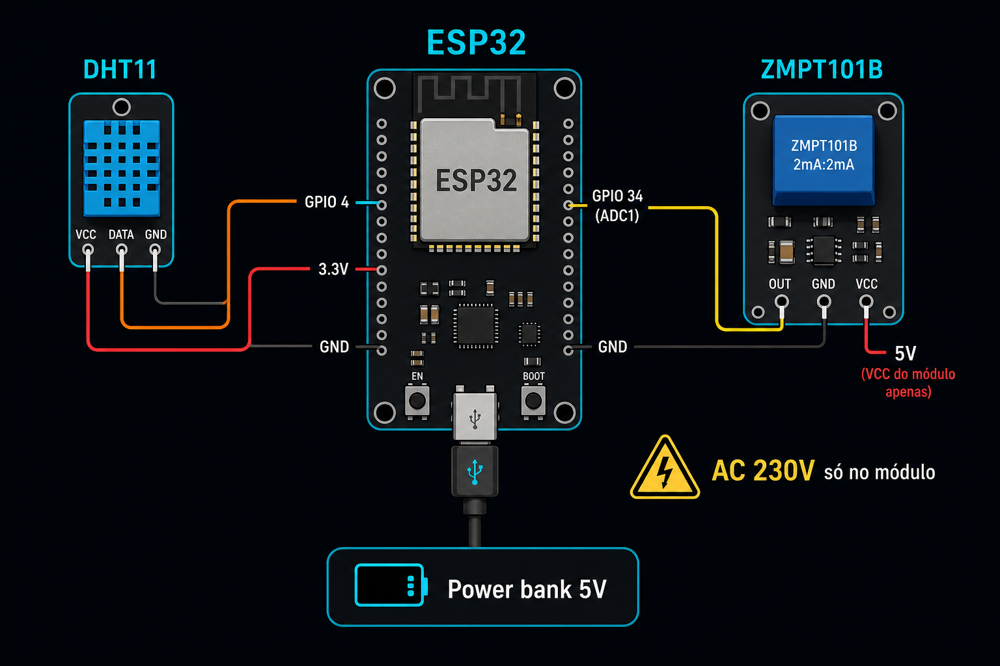
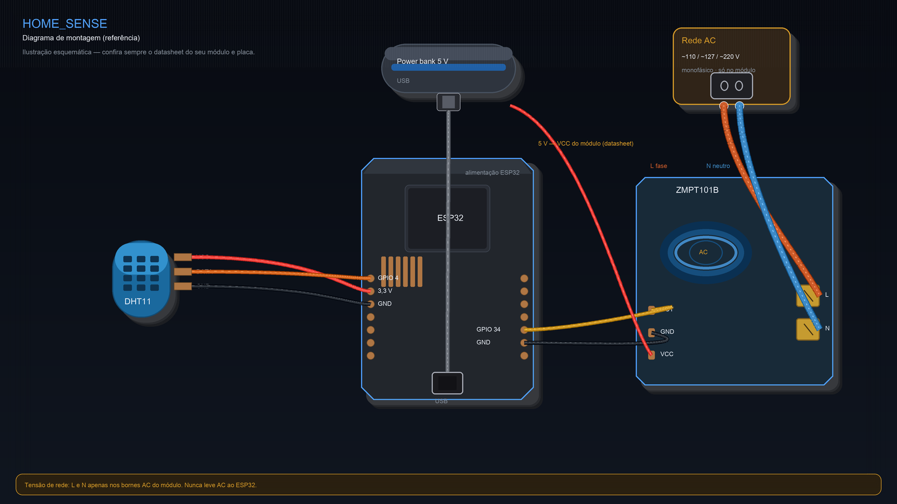

# HOME_SENSE

## Capturas de tela

Imagens de **2 de maio de 2026** (~16:55), para referência visual do projeto:


---

Sistema IoT para monitoramento de **clima** (temperatura / humidade) e **energia** (tensão AC aproximada), com edge em **ESP32**, gateway **fog** (Kotlin/Ktor), backend **cloud** (Spring Boot + PostgreSQL + MQTT) e **app Android** (Jetpack Compose).

---

## Índice

1. [Capturas de tela](#capturas-de-tela)  
2. [Visão geral da arquitetura](#visão-geral-da-arquitetura)  
3. [Hardware necessário](#hardware-necessário)  
4. [Pinagens (ESP32)](#pinagens-esp32)  
5. [Diagrama de ligação](#diagrama-de-ligação)  
6. [Montagem e segurança](#montagem-e-segurança)  
7. [Alimentação recomendada (power bank)](#alimentação-recomendada-power-bank)  
8. [Software — o que roda onde](#software--o-que-roda-onde)  
9. [Infraestrutura com Docker](#infraestrutura-com-docker-mosquitto--postgresql)  
10. [Como utilizar (passo a passo)](#como-utilizar-passo-a-passo)  
11. [Testar sem ESP32 e sem sensores](#testar-sem-esp32-e-sem-sensores)  
12. [Variáveis de ambiente úteis](#variáveis-de-ambiente-úteis)  
13. [Resolução de problemas](#resolução-de-problemas)  
14. [Idioma (pt-BR)](#idioma-pt-br)

---

## Visão geral da arquitetura

```
[ESP32 + DHT11 + ZMPT101B] ──MQTT──► [Fog Ktor] ──MQTT──► [Cloud Spring Boot] ──HTTP──► [App Android]
              edge/*                    fog/*              PostgreSQL
```

- O **ESP32** publica em `homesense/edge/{id}/env` e `.../power`.  
- O **Fog** assina `homesense/edge/#`, normaliza e reenvia (republish) para `homesense/fog/{id}/...`.  
- A **Cloud** assina `homesense/fog/#`, registra leituras e expõe REST para o **Android**.

---

## Hardware necessário

| Item | Função |
|------|--------|
| **Placa ESP32** (ex.: ESP32-DevKitC) | Edge: Wi‑Fi, MQTT, ADC, GPIO |
| **Sensor DHT11** (ou DHT22; o firmware está para modelo 11) | Temperatura e humidade relativa |
| **Módulo ZMPT101B** (com circuito pronto para AC) | Leitura aproximada da tensão da rede (saída analógica) |
| **Fonte USB 5 V** ou **power bank** | Alimentação do ESP32 (ver seção dedicada) |
| **Cabo USB** compatível com a placa | Dados / alimentação |
| **PC ou Raspberry Pi** (opcional mas típico) | Broker MQTT (Mosquitto), Fog, Cloud, em desenvolvimento |
| **Rede Wi‑Fi** | ESP32 e serviços na mesma LAN (ou túnel/VPN conforme configuração) |

**Opcional:** resistor de pull-up **4,7 kΩ – 10 kΩ** na linha de dados do DHT11 (muitas placas DHT11 já trazem; se leituras falharem, confirme o esquema do seu módulo).

---

## Pinagens (ESP32)

Valores definidos em `edge/include/config.h` (ajuste se alterar o hardware).

### DHT11 → ESP32

| Pino do DHT11 | Ligação ao ESP32 | Notas |
|---------------|------------------|--------|
| **VCC** | **3,3 V** | O DHT11 costuma aceitar 3,3 V; **não** use 5 V se o seu módulo não for especificamente 5 V tolerante no data. |
| **GND** | **GND** | Terra comum com o ESP32. |
| **DATA** | **GPIO 4** | Sinal digital one-wire. |

### Módulo ZMPT101B (saída analógica) → ESP32

| Saída do módulo | Ligação ao ESP32 | Notas |
|-----------------|------------------|--------|
| **OUT / A0** (analógico) | **GPIO 34** | ADC1; entrada apenas (sem pull-up interno útil para AC). |
| **GND** | **GND** | Obrigatório: referência comum com o ESP32. |
| **VCC do módulo** | Conforme especificação do fabricante (geralmente 5 V ou 3,3 V) | Siga **exclusivamente** o datasheet da sua placa ZMPT101B. |

### Rede AC (110 / 127 / 230 V) → módulo ZMPT101B **somente nos bornes do módulo**

| Fio / condutor | Onde ligar no módulo | Notas |
|----------------|----------------------|--------|
| **Fase (L)** | Terminal AC marcado **L** / **Live** / **~** (conforme silk do fabricante) | Use fio com secção e isolação adequadas à corrente do circuito; **nunca** leve este fio ao ESP32. |
| **Neutro (N)** | Terminal AC marcado **N** / **Neutral** | Mesmo cuidado de isolamento; em diagramas Fritzing, desenhe **dois fios** explícitos da “tomada” até estes bornes. |

**Importante:** o lado **rede AC** (ex.: **~110 V**, **~127 V** ou **~230 V**, conforme a região) deve estar **apenas** no módulo certificado e montado por quem tem competências elétricas. Não ligue AC diretamente ao ESP32. Mau uso pode causar **choque elétrico** ou **incêndio**.

---

## Diagrama de ligação

Visão lógica das ligações (GND comum entre DHT11, ESP32 e módulo ZMPT; **fios da rede monofásica (fase L e neutro N)** só nos terminais AC do módulo ZMPT; alimentação USB do ESP32 recomendada via **power bank** para demo estável).



Ilustrações de referência (**não** substituem o datasheet do seu módulo ZMPT nem o pinout da sua placa ESP32):

**1 — Montagem (Fritzing ou foto)** — ficheiro `docs/wiring-home-sense.png` (substitua pelo seu export ou fotografia com legendas):



**2 — Esquema ilustrado (gerado por código)** — ficheiro `docs/wiring-home-sense-schematic.png` (atualizado com `python3 tools/render_wiring_diagram.py`):



### Fidelidade tipo breadboard ou foto (caminho recomendado)

Para documentação com **aspecto de montagem real** (componentes reconhecíveis, cores de jumpers, breadboard), use um destes fluxos e **versiona o PNG** (e, se quiser, o projeto Fritzing) no repositório.

**A — Fritzing**  
1. Monte a vista **breadboard** no [Fritzing](https://fritzing.org/): ESP32, DHT11, módulo ZMPT101B, jumpers, e **dois fios da rede** (fase **L** e neutro **N**) só nos **bornes AC** do módulo — o ESP32 liga apenas a **OUT**, **VCC** e **GND** do módulo, **nunca** a AC.  
2. `Arquivo → Exportar → como imagem` (PNG), preferencialmente **só a vista breadboard** ou com legenda no próprio Fritzing.  
3. Substitua `docs/wiring-home-sense.png` por esse export (mantém o link da **figura 1** deste README) **ou** guarde outro nome (ex.: `docs/wiring-montagem-fritzing.png`) e altere o `` da figura 1.  
4. *(Opcional)* Inclua o `.fzz` em `docs/` para outros poderem editar o mesmo desenho (ficheiros Fritzing costumam ser grandes; vale a pena para trabalhos de grupo).

**B — Foto real + legendas**  
1. Fotografe a montagem com boa luz e foco.  
2. Num editor de imagem (ou no relatório do curso), acrescente **setas e rótulos** (GPIO 4, 3,3 V, GND, GPIO 34, VCC do ZMPT, **L** e **N** na rede).  
3. Exporte para `docs/wiring-home-sense.png` ou outro ficheiro referenciado no README.

**Esquema ilustrado (opcional, figura 2)**  
O ficheiro `docs/wiring-home-sense-schematic.png` é gerado por `python3 tools/render_wiring_diagram.py` (dependência **Pillow** em `tools/requirements.txt`). Serve como **esquema rápido** em CI ou documentação; **não** substitui a fidelidade visual de **Fritzing** nem de **foto**. O script **não** altera `docs/wiring-home-sense.png`.

---

## Montagem e segurança

1. Monte o **DHT11** com alimentação e terra corretos; verifique se o data está no **GPIO 4**.  
2. Use um **módulo ZMPT101B completo** (não apenas o sensor toroidal solto) com saída já condicionada para leitura por microcontrolador.  
3. Calibre o fator RMS no firmware (`edge/src/main.cpp`, constante `calibration`) com **multímetro** e rede estável, comparando com o valor lido.  
4. Garanta **terra comum** entre ESP32, DHT e módulo ZMPT (GND partilhado).

---

## Alimentação recomendada (power bank)

Em **demonstrações** ou em instalações reais, quando há **corte de energia na rede**, o objetivo é que o **ESP32 continue a medir e a enviar MQTT** (por exemplo para registrar a queda e o retorno da energia).

- **Recomendação:** alimentar o ESP32 por **USB a partir de um power bank** de boa qualidade, em paralelo com a lógica de medição da rede no ZMPT (a parte AC continua no módulo ZMPT; o ESP32 só lê a saída analógica).  
- Assim, um **pico ou corte na iluminação da casa** não “desliga” o microcontrolador por falta de USB no notebook ou por instabilidade da mesma fase que está sendo monitorada — o **power bank** funciona como **UPS simples** para o edge.  
- Use cabo USB confiável; power banks com **saída 5 V estável** e corrente suficiente (≥ 500 mA) costumam bastar para um ESP32 típico.

**Nota:** o power bank **não** substitui as regras de segurança no lado AC do ZMPT101B; apenas estabiliza a alimentação do ESP32.

---

## Software — o que roda onde

| Componente | Pasta | Tecnologia |
|------------|-------|------------|
| **Edge** | `edge/` | C++ / Arduino (PlatformIO) |
| **Fog** | `fog/gateway/` | Kotlin, Ktor, Koin, MQTT |
| **Cloud** | `cloud/backend/` | Kotlin, Spring Boot, JPA, PostgreSQL, MQTT |
| **Android** | `android/` | Kotlin, Compose, Hilt |
| **Simulador MQTT** | `tools/` | Python 3, `paho-mqtt` |

Serviços externos típicos:

- **Mosquitto** (ou outro broker MQTT) na porta **1883** (ou TLS noutra porta).  
- **PostgreSQL** para a Cloud.

---

## Infraestrutura com Docker (Mosquitto + PostgreSQL)

Na **raiz** do repositório (`HOME_SENSE/`) existe um `docker-compose.yml` que sobe:

| Serviço | Imagem | Porta | Função |
|---------|--------|-------|--------|
| **mqtt** | `eclipse-mosquitto:2` | **1883** | Broker MQTT (config em `infra/mosquitto/mosquitto.conf`) |
| **postgres** | `postgres:16-alpine` | **5432** | Base `homesense`, usuário `homesense`, senha `homesense` |

**Aviso de segurança:** a configuração MQTT permite **anônimos** e a base usa credenciais **fracas** — **apenas** para laboratório ou vídeo de demonstração. Em produção use senhas fortes, `allow_anonymous false` e TLS.

### Subir e parar

```bash
cd HOME_SENSE   # pasta onde está o docker-compose.yml
docker compose up -d
docker compose ps
# Parar:
docker compose down
```

Com os contêineres rodando em `localhost`, a Cloud pode usar:

```bash
export HOMESENSE_DB_URL=jdbc:postgresql://localhost:5432/homesense
export HOMESENSE_DB_USER=homesense
export HOMESENSE_DB_PASS=homesense
export HOMESENSE_MQTT_HOST=127.0.0.1
export HOMESENSE_MQTT_PORT=1883
```

O simulador Python (`tools/mqtt_esp32_simulator.py`) pode usar `--host 127.0.0.1` com o mesmo broker.

---

## Como utilizar (passo a passo)

### 1. Broker MQTT

**Opção A — Docker (recomendado para demo rápida):** já incluído no [compose](#infraestrutura-com-docker-mosquitto--postgresql) acima (`docker compose up -d`).

**Opção B — Mosquitto instalado no sistema** (Linux/macOS):

```bash
mosquitto -c /caminho/para/mosquitto.conf
# ou o serviço do sistema: brew services start mosquitto
```

Anote o **IP** e a **porta** (por padrão `1883`).

### 2. Base de dados (Cloud)

**Se usou Docker:** a base `homesense` e o usuário já existem — você pode avançar para o passo 3.

**Se instalou o PostgreSQL manualmente**, crie a base e o usuário (exemplo alinhado ao `application.yml`):

```sql
CREATE USER homesense WITH PASSWORD 'homesense';
CREATE DATABASE homesense OWNER homesense;
```

### 3. Backend Cloud

```bash
cd cloud/backend
./gradlew bootRun
```

Por padrão a API fica em **http://localhost:8081** (ver `application.yml` / `HOMESENSE_CLOUD_PORT`).

Defina, se necessário:

- `HOMESENSE_DB_URL`, `HOMESENSE_DB_USER`, `HOMESENSE_DB_PASS`  
- `HOMESENSE_MQTT_HOST`, `HOMESENSE_MQTT_PORT`  
- `HOMESENSE_MQTT_ENABLED=true` para a Cloud assinar os tópicos MQTT.

Endpoints úteis para o app:

- `GET /api/v1/climate/{deviceId}`  
- `GET /api/v1/energy/{deviceId}/voltage`  
- `GET /api/v1/energy/{deviceId}/outages`

### 4. Gateway Fog (opcional, mas recomendado no fluxo completo)

```bash
cd fog/gateway
export HOMESENSE_MQTT_HOST=<IP_do_broker>
./gradlew run
```

Health: `http://localhost:8080/health`

### 5. Firmware ESP32

1. Copie `edge/include/secrets.example.h` para `edge/include/secrets.h` e preencha **Wi-Fi** e **MQTT**.  
2. Com [PlatformIO](https://platformio.org/):

```bash
cd edge
pio run -t upload
pio device monitor
```

O firmware publica a cada **30 s** (ver `PUBLISH_INTERVAL_MS`).

### 6. App Android

1. **Android Studio** recente (recomendado **2023.2+**) com **JDK 17** (Settings → Build → Gradle → *Gradle JDK* = 17).  
2. **Abrir:** *File → Open…* → pasta **`HOME_SENSE/android/`** (onde estão `settings.gradle.kts` e `build.gradle.kts` na raiz do projeto Android).  
3. **`local.properties`:** deve existir `sdk.dir=/caminho/Android/sdk` (no Mac: `~/Library/Android/sdk`). O Studio costuma criar ao abrir.  
4. **Gradle Sync:** aguarde terminar; *Trust Project* se aparecer. Erros de dependência: verifique internet e repositórios Google/Maven.  
5. **HTTP local:** o app usa `http://` no `BuildConfig`; o manifest tem `usesCleartextTraffic="true"` para desenvolvimento (evita bloqueio de HTTP no Android 9+).  
6. **`HOMESENSE_API_BASE_URL`** em `app/build.gradle.kts`: **emulador** → `http://10.0.2.2:8081/`; **celular no Wi-Fi** → `http://<IP_do_PC>:8081/`. Depois de alterar, faça *Sync* e execute de novo.  
7. **Run ▶:** módulo **app**, AVD ou celular com *USB debugging*. Inicie a **Cloud** na porta 8081 antes do app.  
8. **`deviceId`:** por padrão **`demo-device`** no `HomeViewModel` — alinhe com o simulador MQTT ou com o MAC do ESP nos tópicos.

Compile / instale pela IDE ou:

```bash
cd android
./gradlew installDebug
```

---

## Testar sem ESP32 e sem sensores

Ideal para **vídeo de demonstração** ou desenvolvimento sem hardware.

### Simulador Python (recomendado)

```bash
cd tools
pip install -r requirements.txt
```

- **Com Fog + Cloud** (mensagens como o ESP real, prefixo `edge`):

```bash
python3 mqtt_esp32_simulator.py --host <IP_DO_BROKER> --device-id demo-device
```

- **Só Cloud** (sem o Fog em execução): use o prefixo `fog` e o payload com campo `q` no JSON de clima:

```bash
python3 mqtt_esp32_simulator.py --host <IP_DO_BROKER> --prefix fog --device-id demo-device
```

- **Cenário queda e retorno da tensão** (útil para gravar o fluxo de energia):

```bash
python3 mqtt_esp32_simulator.py --host <IP_DO_BROKER> --prefix fog --device-id demo-device --demo-outage
```

Parâmetros úteis: `--interval 10`, `--port 1883`, `--user`, `--password`.

### Ordem mínima para teste “só software”

1. Mosquitto em execução.  
2. PostgreSQL + Cloud `bootRun` com MQTT ativo.  
3. (Opcional) Fog `./gradlew run`.  
4. Simulador Python com `--device-id` igual ao que o **Android** pede na API.  
5. App Android com `HOMESENSE_API_BASE_URL` apontando para o backend (ex.: `http://10.0.2.2:8081/` no emulador).

---

## Variáveis de ambiente úteis

| Área | Exemplos |
|------|-----------|
| **Cloud** | `HOMESENSE_DB_*`, `HOMESENSE_MQTT_*`, `HOMESENSE_CLOUD_PORT`, `HOMESENSE_MQTT_ENABLED`, `HOMESENSE_ENERGY_ZERO_MAX_VOLTS`, `HOMESENSE_ENERGY_OUTAGE_CONFIRM_SECONDS` |
| **Fog** | `HOMESENSE_MQTT_HOST`, `HOMESENSE_MQTT_PORT`, `HOMESENSE_MQTT_SUBSCRIBE`, `HOMESENSE_FOG_TOPIC_PREFIX`, `HOMESENSE_FOG_HTTP_PORT` |
| **Android** | `HOMESENSE_API_BASE_URL` em `build.gradle.kts` (`BuildConfig`) |

---

## Resolução de problemas

| Sintoma | O que verificar |
|---------|----------------|
| ESP32 não liga ao Wi‑Fi | `secrets.h`, intensidade do sinal, banda 2,4 GHz |
| Sem mensagens na Cloud | Broker acessível, `homesense.mqtt.enabled=true`, tópicos `fog/#` se só Cloud; Fog reenviando se usar `edge` |
| App sem dados | URL da API, `deviceId`, firewall, backend em execução |
| Tensão sempre errada | Calibração ZMPT no firmware; limiares na Cloud (`zero-max-volts`) |
| Gradle Android falha | `local.properties` com `sdk.dir` correto |
| Docker: porta 1883 ou 5432 em uso | Pare o serviço local ou altere as portas no `docker-compose.yml`. |

---

## Idioma (pt-BR)

A documentação e os comentários visam o **português do Brasil** (por exemplo: *celular*, *usuário*, *senha*, *por padrão*, *tela* do app — não se usa *ecrã*). Se encontrar termos europeus, pode abrir um *issue* ou corrigir com um *pull request*.

---

## Licença e projeto acadêmico

Este repositório destina-se a fins educacionais (projeto de curso IoT). Adapte credenciais, TLS em MQTT e políticas de segurança antes de qualquer uso em produção.

Projeto elaborado para conclusão do curso:  
Pós-graduação em Desenvolvimento Mobile com IoT.

Ideia voltada a resolver e monitorar problemas de pico de energia fornecidos pela Light — Volta Redonda, RJ.

Aluno: Samuel Teodoro Ferreira
